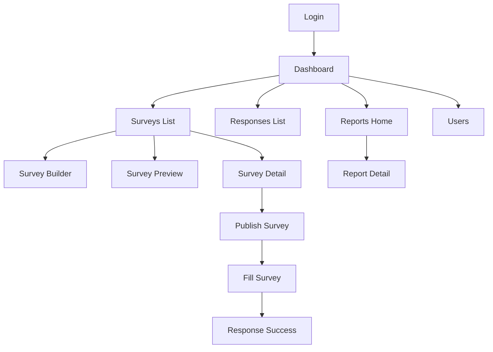

# Dashboard de Barómetro Institucional

Arquitectura propuesta para una aplicación web tipo Google Forms orientada a una universidad, construida con Angular 20+, TypeScript, Standalone Components y enfoque Feature-Based.

## 0) Guía rápida para personas nuevas

Si es tu primera vez en este repo, empieza aquí.

### Qué es este proyecto

- Una app web tipo Google Forms para universidad.
- Permite crear formularios, responder encuestas, ver KPIs y exportar resultados.
- Está en fase **mock-first**: sin base de datos real todavía.

### Qué stack usa

- Angular (Standalone Components, rutas lazy, TypeScript).
- Arquitectura Feature-Based + capas (`core`, `shared`, `features`, `data-access`).
- **Bun** como package manager oficial del proyecto.

### Cómo levantar y validar

1. `bun install`
2. `bun run start`
3. `CI=true bun run build`
4. `CI=true bun run test`

### Regla importante del repositorio

- Usar **Bun**. Evitar `npm` y `pnpm` para flujo normal.

### Estado actual en una frase

- El sistema es funcional para flujo principal (auth mock, formularios, respuestas, dashboard, reportes, exportación), con pendientes de refinamiento en componentes y analítica avanzada.

### Dónde tocar según lo que necesites

- UI y pantallas: `src/app/features/**/pages`
- Lógica de feature: `src/app/features/**/services`
- Persistencia mock: `src/app/data-access/adapters/local`
- Contratos de datos: `src/app/data-access/repositories`
- Infraestructura global: `src/app/core`
- Reutilizables: `src/app/shared`

### Qué falta (prioridad real)

1. Completar componentes placeholder de algunas features.
2. Mejorar constructor Likert (configuración completa de escala/etiquetas).
3. Filtros avanzados y analítica más profunda en reportes.
4. Más pruebas de páginas/componentes críticos.

### Cómo continuar sin romper la arquitectura

1. Si agregas una operación de datos:
- Primero contrato en `repositories`.
- Luego implementación en `adapters/local`.
- Después uso desde `facade` de la feature.
2. Mantener textos visibles en español.
3. Cerrar siempre con `build` y `test` en verde.

### Si usas IA para continuar

- No asumir que todo lo listado en arquitectura está 100% integrado en UI.
- Verificar rutas/páginas reales antes de refactorizar.
- Priorizar cambios pequeños, funcionales y verificables.

## 1) Objetivo del proyecto

Construir un sistema modular para:

- Crear y administrar formularios dinámicos.
- Recopilar respuestas con validación.
- Visualizar KPIs y reportes.
- Exportar resultados en XLS/XLSX.

Primera fase sin base de datos, usando mocks y servicios locales, con diseño preparado para migración a Supabase PostgreSQL.

## 2) Principios de arquitectura

- Feature-Based por dominio (`auth`, `surveys`, `responses`, etc.).
- Standalone Components + rutas lazy por feature.
- Separación estricta de capas: UI, dominio, acceso a datos.
- Contratos estables (repositorios) para cambiar persistencia sin romper features.
- Reutilización transversal en `core` y `shared`.
- Diseño escalable para cientos de formularios y miles de respuestas.

## 2.1) Estado real actual del proyecto (junio 2026)

### Implementado y funcional

- Autenticación mock con sesión local y protección de rutas.
- Shell de navegación y estructura Feature-Based.
- Gestión de formularios:
  - listar, crear, editar, duplicar, cambiar estado, eliminar, vista previa y detalle.
- Respuestas:
  - listado con filtros,
  - formulario dinámico por tipo de pregunta,
  - validación dinámica,
  - pantalla de éxito al enviar.
- Dashboard:
  - KPIs y visualización tipo barras de respuestas por formulario.
- Reportes:
  - home + detalle por formulario,
  - exportación XLSX de reporte y respuestas.
- Capa de datos con contratos de repositorio + adapters `local` (mocks en memoria).
- Base de testing unitario activa (Vitest vía `ng test`) con pruebas de servicios/adapters/facades.

### No implementado por decisión actual

- Integración real con Supabase/PostgreSQL (se mantiene en stubs).

## 2.2) Qué está pendiente (prioridad alta)

- Completar integración real de componentes de feature que hoy están como placeholder.
- Mejorar constructor Likert (configurar min, max y etiquetas desde UI).
- Drag and drop real con CDK para reordenar preguntas.
- Reportes con filtros avanzados (ej. rango de fechas) y analítica por pregunta más rica.
- Cobertura de pruebas sobre páginas/componentes críticos (no solo servicios/adapters).

## 2.3) Guía de continuidad para equipo/IA (handoff)

### Contexto de trabajo

- El proyecto está en modo **mock-first**.
- Toda persistencia actual es local en adapters `src/app/data-access/adapters/local`.
- No crear dependencias a Supabase hasta que exista esquema definitivo de BD.
- Este proyecto usa **Bun** como package manager principal.
- No usar `npm` ni `pnpm` para instalación o ejecución habitual.

### Comandos de validación obligatorios antes de cerrar cambios

1. `bun install`
2. `CI=true bun run build`
3. `CI=true bun run test`

### Convenciones para continuar sin romper arquitectura

- Si agregas lógica de negocio, colócala en `features/*/services` o `data-access/*`, no en componentes de UI.
- Si agregas almacenamiento, primero extiende `repositories/*` y luego adapters (`local` y futuro `supabase`).
- Mantener UI visible en español.
- Mantener enfoque SOLID (facade + repository + adapter).

### Próximo bloque recomendado de implementación

1. Reemplazar placeholders de componentes por implementaciones reales o removerlos si no se usarán.
2. Terminar configuración avanzada de preguntas Likert en `survey-builder`.
3. Añadir filtros por fecha en reportes/respuestas + pruebas unitarias asociadas.
4. Elevar cobertura con tests de páginas clave (`surveys-list`, `survey-builder`, `reports-home`, `response-fill`).

### Nota para asistentes IA que retomen este repositorio

- No asumir que lo descrito en arquitectura está 100% integrado: verificar uso real en rutas/páginas.
- Priorizar cambios incrementales y verificables (build + test en verde).
- Evitar refactors masivos antes de cerrar pendientes funcionales actuales.

## 3) Estructura de carpetas (árbol completo)

```text
src/
  app/
    app.config.ts
    app.routes.ts

    core/
      constants/
        app.constants.ts
        route.constants.ts
        role.constants.ts
      guards/
        auth.guard.ts
        role.guard.ts
        unsaved-changes.guard.ts
      interceptors/
        auth.interceptor.ts
        error.interceptor.ts
        loading.interceptor.ts
      layout/
        shell/
          shell.component.ts
        topbar/
          topbar.component.ts
        sidebar/
          sidebar.component.ts
      services/
        auth-session.service.ts
        notification.service.ts
        logger.service.ts
        loading.service.ts
      tokens/
        repository.tokens.ts
      state/
        app.store.ts
      utils/
        date.util.ts
        number.util.ts

    shared/
      components/
        app-table/
        app-chart/
        app-empty-state/
        app-confirm-dialog/
        app-status-chip/
        app-kpi-card/
        app-form-field-wrapper/
      directives/
        has-role.directive.ts
        autofocus.directive.ts
      pipes/
        form-status.pipe.ts
        question-type.pipe.ts
      validators/
        survey.validators.ts
        response.validators.ts
      models/
        ui.model.ts
        api.model.ts
        pagination.model.ts
      ui/
        material.module.ts
        primeng.module.ts
      helpers/
        file-export.helper.ts
        chart.helper.ts

    data-access/
      adapters/
        local/
          local-auth.adapter.ts
          local-survey.adapter.ts
          local-response.adapter.ts
          local-report.adapter.ts
        supabase/
          supabase-auth.adapter.ts
          supabase-survey.adapter.ts
          supabase-response.adapter.ts
          supabase-report.adapter.ts
      repositories/
        auth.repository.ts
        survey.repository.ts
        response.repository.ts
        report.repository.ts
        user.repository.ts
      mappers/
        survey.mapper.ts
        response.mapper.ts
      mocks/
        users.mock.json
        surveys.mock.json
        responses.mock.json

    features/
      auth/
        pages/
          login-page/
        components/
          login-form/
        services/
          auth.facade.ts
        models/
          auth.model.ts
        routes/
          auth.routes.ts

      dashboard/
        pages/
          dashboard-home-page/
        components/
          kpi-grid/
          active-surveys-list/
          response-trend-chart/
          quick-actions/
        services/
          dashboard.facade.ts
        models/
          dashboard.model.ts
        routes/
          dashboard.routes.ts

      users/
        pages/
          users-list-page/
          user-form-page/
        components/
          user-table/
          user-form/
          role-badge/
        services/
          users.facade.ts
        models/
          user.model.ts
        routes/
          users.routes.ts

      surveys/
        pages/
          surveys-list-page/
          survey-builder-page/
          survey-preview-page/
          survey-detail-page/
        components/
          survey-header-form/
          question-list/
          question-item/
          question-editor/
          question-type-selector/
          likert-scale-config/
          options-editor/
          survey-status-actions/
        services/
          surveys.facade.ts
          question-factory.service.ts
        models/
          survey.model.ts
          question.model.ts
        routes/
          surveys.routes.ts

      responses/
        pages/
          response-fill-page/
          response-success-page/
          responses-list-page/
        components/
          dynamic-question-renderer/
          response-form/
          response-progress/
        services/
          responses.facade.ts
          response-validation.service.ts
        models/
          response.model.ts
        routes/
          responses.routes.ts

      reports/
        pages/
          reports-home-page/
          report-detail-page/
        components/
          report-filter-bar/
          report-summary-cards/
          report-charts/
          report-table/
          export-actions/
        services/
          reports.facade.ts
          export.service.ts
        models/
          report.model.ts
        routes/
          reports.routes.ts
```

## 4) Qué contiene cada carpeta

### `core`
Infraestructura global singleton:

- Seguridad: guards e interceptors.
- Layout base de la aplicación (shell + navegación).
- Servicios transversales (logger, loading, notificaciones, sesión).
- Tokens de inyección y constantes globales.

### `shared`
Recursos reutilizables sin lógica de negocio específica:

- Componentes de UI genéricos.
- Directivas, pipes y validadores compartidos.
- Utilidades de exportación y gráficos.
- Modelos transversales (paginación, estados UI, contrato de respuesta API).

### `data-access`
Capa de persistencia desacoplada:

- Interfaces de repositorio por agregado de dominio.
- Adaptadores locales para la fase sin BD.
- Adaptadores Supabase listos para activarse por environment.
- Mappers para traducir DTO ↔ dominio.

### `features`
Módulos funcionales autocontenidos:

- Páginas (containers por ruta).
- Componentes internos de la feature.
- Facades y servicios de orquestación.
- Modelos propios del dominio.
- Rutas internas de la feature.

## 5) Componentes y páginas por feature

### `auth`
- Página: `login-page`.
- Componentes: `login-form`.
- Responsabilidad: autenticación, inicio de sesión y sesión activa.

### `dashboard`
- Página: `dashboard-home-page`.
- Componentes: KPIs, listas de formularios activos, tendencia de respuestas, acciones rápidas.
- Responsabilidad: vista ejecutiva y estado general del sistema.

### `users`
- Páginas: listado y alta/edición.
- Componentes: tabla, formulario y badge de rol.
- Responsabilidad: administración de usuarios y roles.

### `surveys`
- Páginas: listado, builder, preview, detalle.
- Componentes: editor de preguntas, configurador de opciones, selector de tipo, acciones de estado.
- Responsabilidad: ciclo de vida completo del formulario.

### `responses`
- Páginas: responder encuesta, éxito de envío, listado de respuestas.
- Componentes: renderer dinámico de preguntas, progreso, formulario de respuesta.
- Responsabilidad: captura y validación de respuestas.

### `reports`
- Páginas: home de reportes y detalle por formulario.
- Componentes: filtros, tarjetas resumen, gráficos, tabla, exportación.
- Responsabilidad: análisis y salida de datos.

## 6) Modelos e interfaces necesarias

### Entidades base

- `User`: id, name, email, role, isActive, createdAt.
- `Role`: `ADMIN | ANALYST | VIEWER`.
- `AuthSession`: userId, role, tokenMock, expiresAt.

### Formularios

- `Survey`: id, title, description, status, version, createdBy, createdAt, updatedAt, questions.
- `SurveyStatus`: `DRAFT | IMPLEMENTED | ARCHIVED`.
- `QuestionType`: `MULTIPLE_CHOICE | SINGLE_CHOICE | LIKERT | TEXT | NUMBER`.

### Preguntas

- `QuestionBase`: id, type, label, required, order, helpText.
- `ChoiceQuestion`: options, allowOther.
- `LikertQuestion`: scaleMin, scaleMax, labels.
- `TextQuestion`: minLength, maxLength, placeholder.
- `NumberQuestion`: min, max, step.

### Respuestas

- `Response`: id, surveyId, answers, submittedAt, respondentMeta.
- `Answer`: questionId, value.

### Reportes y listados

- `KpiSummary`: totalSurveys, totalResponses, activeSurveys, completionRate.
- `ReportFilter`: surveyId, dateFrom, dateTo, segment.
- `ReportDataset`: aggregatedMetrics, chartSeries, tableRows.
- `PaginationQuery`: page, pageSize, sortBy, sortDir, search.

## 7) Servicios necesarios

- `AuthFacade`, `UsersFacade`, `SurveysFacade`, `ResponsesFacade`, `ReportsFacade`.
- `QuestionFactoryService` para crear preguntas por tipo con defaults válidos.
- `ResponseValidationService` para validación dinámica según tipo.
- `ExportService` para XLS/XLSX.
- Repositorios por dominio: `AuthRepository`, `SurveyRepository`, `ResponseRepository`, `ReportRepository`, `UserRepository`.
- Servicios core: sesión, loading, notificaciones, logger.

## 8) Rutas de la aplicación

- `/auth/login`
- `/dashboard`
- `/users`
- `/surveys`
- `/surveys/new`
- `/surveys/:id/edit`
- `/surveys/:id/preview`
- `/surveys/:id`
- `/responses/fill/:surveyId`
- `/responses`
- `/reports`
- `/reports/:surveyId`

Seguridad:

- `auth.guard` en rutas privadas.
- `role.guard` para funciones administrativas.
- `unsaved-changes.guard` en el constructor de formularios.

## 9) Preparación de capa de datos para migrar a Supabase PostgreSQL

- Definir contratos de repositorio desde el primer día.
- Implementar adaptadores locales (fase actual) y Supabase (fase futura) con la misma interfaz.
- Resolver implementación concreta con `InjectionToken` + `environment`.
- Añadir mappers para aislar la UI del formato de almacenamiento.
- Usar UUID y timestamps de auditoría desde el inicio.
- Mantener versionado de formulario para preservar coherencia histórica de respuestas.

## 10) Patrones recomendados

- Feature-Based Architecture + Vertical Slice.
- Facade Pattern para simplificar interacción de páginas con servicios.
- Repository + Adapter para intercambio de fuente de datos.
- Factory/Strategy para tipos de preguntas.
- Container/Presentational para separar orquestación y presentación.
- Estado local con Signals por feature; escalar a NgRx solo si se requiere coordinación compleja global.

## 11) Qué va en `core` y qué va en `shared`

`core`:

- Todo lo singleton, transversal y de infraestructura global.
- Seguridad, layout, interceptors, servicios de app.

`shared`:

- Todo lo reutilizable, sin dependencia de un dominio puntual.
- UI genérica, pipes, directivas y validadores reutilizables.

Regla:

- Si un componente/servicio conoce reglas de negocio de una feature, debe vivir en esa feature, no en `shared`.

## 12) Organización de formularios dinámicos y tipos de preguntas

- Modelo polimórfico (`QuestionBase` + especializaciones).
- `dynamic-question-renderer` decide qué componente pintar según `question.type`.
- `question-factory.service` crea instancias con estructura válida por defecto.
- `response-validation.service` aplica validaciones dinámicas por tipo.
- Reordenamiento con CDK drag and drop y persistencia de propiedad `order`.
- Manejo de obligatoriedad (`required`) y configuración específica (`options`, `limits`, `scale`).

## 13) Flujo de navegación



## 14) Modelos TypeScript principales (referencia de diseño)

```ts
export type Role = 'ADMIN' | 'ANALYST' | 'VIEWER';

export type SurveyStatus = 'DRAFT' | 'IMPLEMENTED' | 'ARCHIVED';

export type QuestionType =
  | 'MULTIPLE_CHOICE'
  | 'SINGLE_CHOICE'
  | 'LIKERT'
  | 'TEXT'
  | 'NUMBER';

export interface User {
  id: string;
  name: string;
  email: string;
  role: Role;
  isActive: boolean;
  createdAt: string;
}

export interface Survey {
  id: string;
  title: string;
  description?: string;
  status: SurveyStatus;
  version: number;
  createdBy: string;
  createdAt: string;
  updatedAt: string;
  questions: Question[];
}

export interface QuestionBase {
  id: string;
  type: QuestionType;
  label: string;
  required: boolean;
  order: number;
  helpText?: string;
}

export interface ChoiceQuestion extends QuestionBase {
  type: 'MULTIPLE_CHOICE' | 'SINGLE_CHOICE';
  options: Array<{ id: string; label: string; value: string }>;
  allowOther?: boolean;
}

export interface LikertQuestion extends QuestionBase {
  type: 'LIKERT';
  scaleMin: number;
  scaleMax: number;
  labels?: Record<number, string>;
}

export interface TextQuestion extends QuestionBase {
  type: 'TEXT';
  minLength?: number;
  maxLength?: number;
  placeholder?: string;
}

export interface NumberQuestion extends QuestionBase {
  type: 'NUMBER';
  min?: number;
  max?: number;
  step?: number;
}

export type Question =
  | ChoiceQuestion
  | LikertQuestion
  | TextQuestion
  | NumberQuestion;

export interface Answer {
  questionId: string;
  value: string | number | string[];
}

export interface Response {
  id: string;
  surveyId: string;
  answers: Answer[];
  submittedAt: string;
  respondentMeta?: Record<string, unknown>;
}
```

## 15) Recomendación de UI: Angular Material o PrimeNG

### Recomendación principal

- Base del sistema: Angular Material + CDK.

Motivos:

- Integración nativa con Angular moderno.
- Excelente soporte para formularios reactivos, tablas, diálogos y accesibilidad.
- CDK útil para drag-and-drop, overlays y virtual scroll.

### Uso opcional de PrimeNG

- Incorporar PrimeNG solo si se necesitan visualizaciones/tablas avanzadas en reportes.
- Encapsular en `shared/ui` para evitar dependencia fuerte del framework visual.

## 16) Estrategia de escalabilidad

- Paginación, orden y búsqueda desde diseño inicial (`PaginationQuery`).
- Lazy loading por feature y carga diferida de componentes pesados.
- Virtual scroll para listados masivos.
- Caching por feature y memoización de agregados estadísticos.
- Preagregaciones para dashboard/reportes en adaptadores de datos.
- Exportación asíncrona para datasets grandes.
- Índices futuros en Supabase sobre `survey_id`, `status`, `submitted_at`.
- Contratos versionados para mantener compatibilidad evolutiva.
- Observabilidad de performance (métricas de render y tiempos de consulta).

## 17) Decisiones clave y justificación

- Separar `features` y `data-access` evita acoplar UI con persistencia.
- Repositorios permiten cambiar local JSON por Supabase sin tocar páginas/componentes.
- Standalone + rutas lazy reduce tiempo de carga y mejora mantenibilidad.
- Modelo de preguntas tipado previene inconsistencias en constructor, respuestas y reportes.
- Facades reducen complejidad de los componentes contenedor y facilitan pruebas.

## 18) Roadmap recomendado por fases

1. Fase 1: arquitectura base, auth mock, CRUD de formularios, responder, dashboard básico.
2. Fase 2: reportes completos, exportación XLS/XLSX, mejoras de UX del builder.
3. Fase 3: migración a Supabase, optimización de consultas, auditoría y trazabilidad avanzada.
4. Fase 4: hardening empresarial (logs, monitoreo, permisos granulares, pruebas E2E).

---

Este documento define una base robusta para iniciar rápido en local y escalar sin reestructuración mayor cuando se integre Supabase PostgreSQL.
